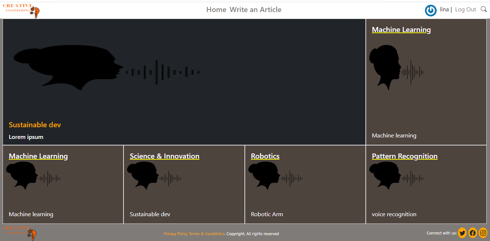

## Creative Engineering Blogs


> The objective of the project is to provide the latest information about innovations, science,  and technology. The website allows a user to create articles, categories, upload an image and receive upvotes for the content and presentation of the article.

 

## Video Explanation
[Project explanation](https://www.loom.com/share/4840314e522d4d48b610fd6a2822f9f7)

## Link to actual webpage
[Website Demo Link](https://creative-eng.herokuapp.com/)

## Built With
* Ruby 2.7.2
* Rails 6.1.3
* PostgreSQL

**To clone and run the application locally, use the following steps:**
- On Github, on the main page of the private-event repository, click  and copy "Clone with HTTPS" by clicking .
- In your terminal, enter a `git clone` and past the link that you copied from the repository, and press the `Enter`
(e.g. git clone https://github.com/gdumani/private-events.git).
- Navigate to the project folder using `cd folder_name`
- To install all dependencies, run `bundle install`
- To create a database, run `db:create`
- To migrate the schema, run `db:migrate`
- Now, you can run your application using the `rails s` command.
- To verify the connection [Visit localhost:3000](http://localhost:3000 ).

## Steps for running and installing RSpec
- add `gem rspec-rails` and `gem 'rexml'` to the Gem file
- run `bundle install`
- run `rails generate rspec:install` to create spec directory and spec_helper.rb files
- run `rails generate rspec:model model_name` to create tests for model associations and validations.
- To test associations in the model using `Shoulda Matchers`:
- Include shoulda-matchers in your Gemfile:
   ```
    group :test do
        gem 'shoulda-matchers', '~> 4.0'
    end
   ```
- Run `bundle install.`
- Place at the bottom of `spec/rails_helper.rb` the following code:

```
Shoulda::Matchers.configure do |config|
  config.integrate do |with|
    with.test_framework :rspec
    with.library :rails
  end
end
```
- You can use the `rspec` or `bundle exec rspec` command to run all spec files.
- To test files in a single directory, run `rspec spec/models`
- To test a single spec file, run `rspec spec/models/user_spec.rb`
- To run a specific example from your user_spec.rb file, run `rspec spec/models/user_spec.rb:5`


## Authors
**Mina**

- GitHub: [@Takhmina175](https://github.com/Takhmina175)
- Twitter: [@Takhmin73630110](https://twitter.com/Takhmin73630110)
- LinkedIn: [Takhmina Makhkamova](https://www.linkedin.com/in/takhmina-makhkamova-7628136b/)


## Show your support

Give a ⭐️ if you like this project!

## License

All rights reserved to Nelson Sakwa and Takhmina Makhkamova.

## Acknowledgements

Design Idea by <a href="https://www.behance.net/sakwadesignstudio">Nelson Sakwa</a>
 and design available on: [Bahance](https://www.behance.net/gallery/14554909/liFEsTlye-Mobile-version)
